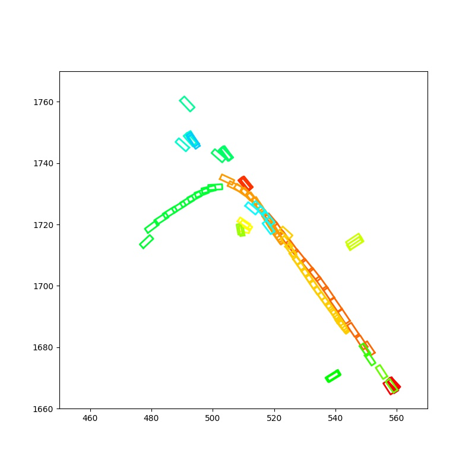
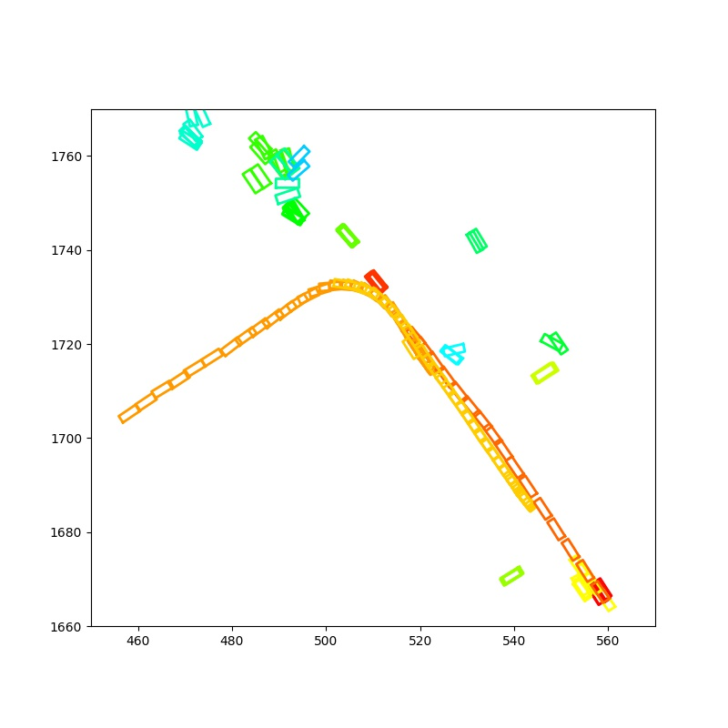
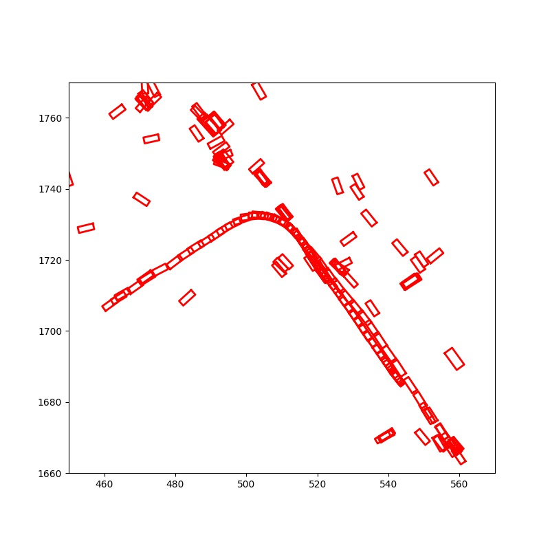
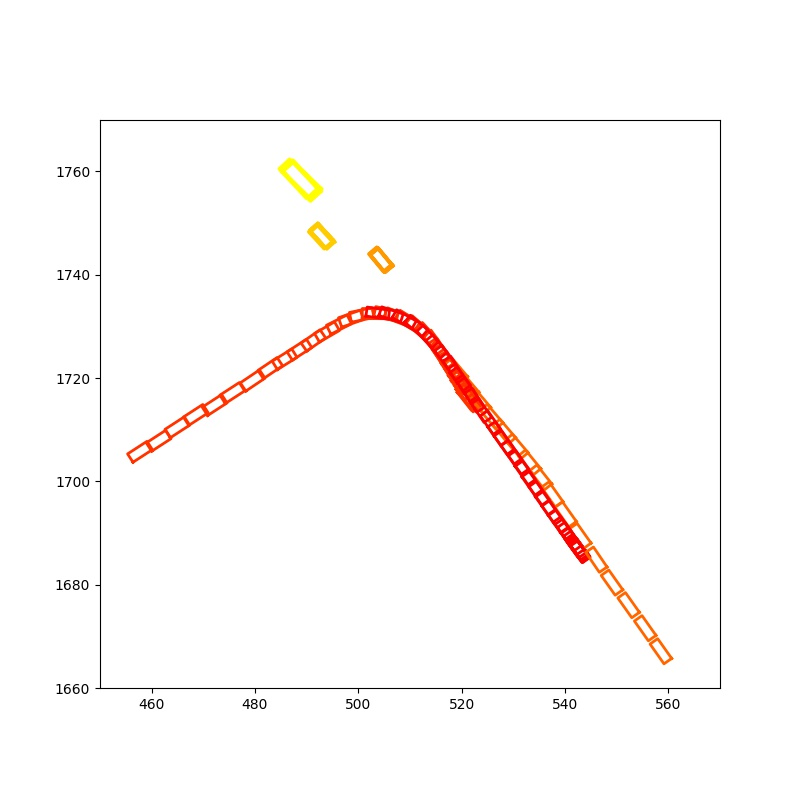

# Probabilistic 3D Multi-Object Tracking for Autonomous Driving

Hsu-kuang Chiu<sup>1</sup>, Antonio Prioletti<sup>2</sup>, Jie Li<sup>2</sup>, Jeannette Bohg<sup>1</sup>

<sup>1</sup>Stanford University, <sup>2</sup>Toyota Research Institute

First Place Award, NuScenes Tracking Challenge, at AI Driving Olympics Workshop, NeurIPS 2019.

 

## Abstract

We present our on-line tracking method, which wins the first place award of the [NuScenes Tracking Challenge](https://www.nuscenes.org/tracking)[1], held in the AI Driving Olympics Workshop at NeurIPS 2019. Our technical report is available in [arxiv](https://arxiv.org/abs/2001.05673). We also provide our source code and the step-by-step instructions to reproduce the validation set performance numbers.


## Quantitative Results

### Validation Set Results

The following table shows our quantitative tracking results for the validation set of NuScenes: evaluation in terms of overall Average Multi-Object Tracking Accuracy (AMOTA) and individual AMOTA for each object category in comparison with the tracking challenge official [AB3DMOT](https://github.com/xinshuoweng/AB3DMOT)[2] baseline results. The AB3DMOT[2] baseline and our method use the same [MEGVII](https://github.com/poodarchu/Det3D)[3] detection results as the input of the tracking systems. For the full validation set results including our implementation of the AB3DMOT[2] baseline and our ablations, please refer to our paper in [arxiv](https://arxiv.org/abs/2001.05673).

Method | Overall | bicycle | bus | car | motorcycle | pedestrian | trailer | truck
---------- | --: | --: | --: | --: | --: | --: | --: | --: 
AB3DMOT\[2\]                      | 17.9 |  0.9 | 48.9 | 36.0 |  5.1 |  9.1 | 11.1 | 14.2
Our proposed method               | 56.1 | 27.2 | 74.1 | 73.5 | 50.6 | 75.5 | 33.7 | 58.0

We can see that our method improves the AMOTAs significantly, especially for the smaller objects, such as pedestrians.


### Test Set Results

The NuScenes Tracking Challenge organizer shared the test set performance of the top 3 participants and the official AB3DMOT[2] baseline, as shown in the following table. The AB3DMOT[2] baseline and our method use the same MEGVII[3] detection results as the input of the tracking systems. The full tracking challenge leaderboard can be seen at the [tracking challenge webpage](https://www.nuscenes.org/tracking).

Rank       | Team Name               | Overall
:--------: | :--                     | --:
1          | StanfordIPRL-TRI (Ours) | 55.0
2          | VV_team                 | 37.1
3          | CenterTrack             | 10.8
baseline   | AB3DMOT\[2\]           | 15.1


## Qualitative Results

The following figures are the bird-eye-view visualization of the tracking results from the official AB3DMOT[2] baseline and our method. For this scene, we draw all the car bounding boxes from different timesteps of the same scene in a single plot. Different colors represent different tracking ids. We also show the ground-truth annotations and the input detections as the references. For more visualization results, please refer to our paper in [arxiv](https://arxiv.org/abs/2001.05673).


AB3DMOT[2] | Ours 
:---:|:---:
 | 


Input Detections | Ground-Truth
:---:|:---:
 | 

We can see that our method is able to better track the object making a sharp turn.


## Using Our Code to Reproduce the Validation Set Results

1. Choose a directory YOUR_WORKING_DIR (mine is /juno/u/hkchiu), and download our code and setup the environment. In the following command, replace /juno/u/hkchiu with YOUR_WORKING_DIR:
```
cd /juno/u/hkchiu
git clone https://github.com/eddyhkchiu/mahalanobis_3d_multi_object_tracking 
conda create --name probabilistic_tracking python=3.6
conda activate probabilistic_tracking
cd mahalanobis_3d_multi_object_tracking
pip install -r requirements.txt
```

2. Choose a directory YOUR_NUSCENES_DEVKIT_DIR (mine is /juno/u/hkchiu) and download the nuscenes devkit. In the following command, replace /juno/u/hkchiu with YOUR_NUSCENES_DEVKIT_DIR:
```
cd /juno/u/hkchiu
git clone https://github.com/nutonomy/nuscenes-devkit.git
cd nuscenes-devkit
pip install -r setup/requirements.txt
```

3. Include nuscenes devkit into python path. In the following command, replace /juno/u/hkchiu with YOUR_NUSCENES_DEVKIT_DIR. Note that you will need to run this everytime after you activate the conda environment): 
```
export PYTHONPATH="${PYTHONPATH}:/juno/u/hkchiu/nuscenes-devkit/python-sdk"
```

4. Choose a directory YOUR_NUSCENES_DATA_DIR (mine is /juno/u/hkchiu/dataset/nuscenes), and download then unzip the mini, trainval, and test data from the NuScenes [download webpage](https://www.nuscenes.org/download). Note that you will need to create an account there. The total size of the zip files is roughly 360GB, and the unzip step also requires the same amount of extra disk space.

5. Choose a directory YOUR_NUSCENES_DETECTION_DIR (mine is /juno/u/hkchiu/dataset/nuscenes_new), and download then unzip the [MEGVII](https://github.com/poodarchu/Det3D)[3]'s detection results from the NuScenes [tracking webpage](https://www.nuscenes.org/data/detection-megvii.zip). 

6. Edit configs: in `config/AB3DMOT.yaml` and `config/mahalanobis.yaml` set `DATA_ROOT` to `YOUR_NUSCENES_DATA_DIR`, and set `DETECTION_FILE` to your detection file in `YOUR_NUSCENES_DETECTION_DIR`. 

7. Run the tracking code of our proposed method and the evaluation code (tracking takes 15 minutes, evaluation takes 90 minutes):
```
python main.py <CONFIG_FILE> <OUTPUT_DIR>
python main.py config/mahalanobis.yaml results
python evaluate_nuscenes.py --output_dir results/mahalanobis results/mahalanobis/megvii_val/results_val_probabilistic_tracking.json
```

8. You can also run our implementation of the AB3DMOT[2] baseline method:
```
python main.py config/AB3DMOT.yaml results
python evaluate_nuscenes.py --output_dir results/AB3DMOT results/AB3DMOT/megvii_val/results_val_probabilistic_tracking.json
```

9. Or you can run all the tracking methods (our implementation of AB3DMOT[2], our ablation methods, and our final proposed method) using the script:
```
source run.sh
```

10. (Optional) You can also run get_nuscenes_stats.py to see how we use the training set data to estimate the Kalman Filter's covariance matrices. (10 minutes) I have hardcoded the results into the covariance.py file, so running get_nuscenes_stats.py is not required to run the above tracking and evaluation commands.
```
python get_nuscenes_stats.py > nuscenes_train_stats.txt
```


## Acknowledgement
- We implemented our method on top of [AB3DMOT](https://github.com/xinshuoweng/AB3DMOT)[2]'s open-source code.

- We used [MEGVII](https://github.com/poodarchu/Det3D)[3]'s detection results as the input of our tracking method.

- Toyota Research Institute ("TRI") provided funds to assist the authors with their research but this article solely reflects the opinions and conclusions of its authors and not TRI or any other Toyota entity.


## References
- \[1\] *"nuScenes: A multimodal dataset for autonomous driving"*, Holger Caesar, Varun Bankiti, Alex H. Lang, Sourabh Vora, Venice Erin Liong, Qiang Xu, Anush Krishnan, Yu Pan, Giancarlo Baldan, and Oscar Beijbom, arXiv:1903.11027, 2019.
- \[2\] *"A Baseline for 3D Multi-Object Tracking"*, Xinshuo Weng and Kris Kitani, arXiv:1907.03961, 2019.

- \[3\] *"Class-balanced Grouping and Sampling for Point Cloud 3D Object Detection"*, Benjin Zhu, Zhengkai Jiang, Xiangxin Zhou, Zeming Li, Gang Yu, arXiv:1908.09492, 2019.

## To Cite Our Paper
```
@ARTICLE{chiu2020probabilistic,
  title={Probabilistic 3D Multi-Object Tracking for Autonomous Driving},
  author={Chiu, Hsu-kuang and Prioletti, Antonio and Li, Jie and Bohg, Jeannette},
  journal={arXiv preprint arXiv:2001.05673},
  year={2020}
}
```

## Relevant Papers

### ICRA 2021

We also have a follow-up ICRA 2021 paper: [Probabilistic 3D Multi-Modal, Multi-Object Tracking for Autonomous Driving](https://arxiv.org/abs/2012.13755), which proposed a deep learning model that can
- learn how to fuse features from 2D images and 3D LiDAR point clouds to capture the appearance and geometric information of an object,
- learn a metric that combines the Mahalanobis and feature distances for data association, and
- learn when to initialize a new track from an unmatched object detection.

```
@ARTICLE{chiu2021probabilistic,
  title={Probabilistic 3D Multi-Modal, Multi-Object Tracking for Autonomous Driving},
  author={Chiu, Hsu-kuang and Li, Jie and Ambrus, Rares and Bohg, Jeannette},
  journal={IEEE International Conference on Robotics and Automation (ICRA)},
  year={2021}
}
```

### ICRA 2024

In my latest ICRA 2024 paper: [Probabilistic 3D Multi-Object Cooperative Tracking for Autonomous Driving via Differentiable Multi-Sensor Kalman Filter](https://arxiv.org/abs/2309.14655), we propose a novel algorithm: DMSTrack for cooperative tracking in autonomous driving. Our algorithm improves the tracking accuracy by 17% with only 0.037x communication costs compared with the state-of-the-art method in V2V4Real, which is the first worldwide available public real-world dataset for vehicle-to-vehicle perception with 3D tracking benchmarks. Our code is available at this [page](https://github.com/eddyhkchiu/DMSTrack/).

```
@ARTICLE{chiu2024probabilistic,
  title={Probabilistic 3D Multi-Object Cooperative Tracking for Autonomous Driving via Differentiable Multi-Sensor Kalman Filter},
  author={Chiu, Hsu-kuang and Wang, Chien-Yi and Chen, Min-Hung and Smith, Stephen F.},
  journal={IEEE International Conference on Robotics and Automation (ICRA)},
  year={2024}
}
```


